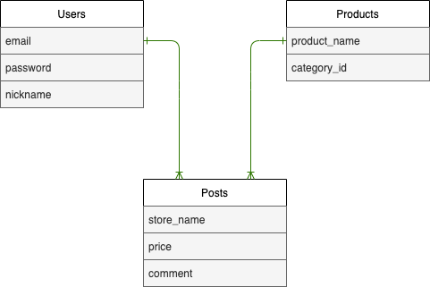

## アプリケーション名
Catcher App

## アプリケーション概要
ゲームセンター等に置かれているUFOキャッチャーで、何を取ったのか(商品)、いくらで取ったのか、どこで取ったのかをユーザー間で共有することができます。

## URL
https://catcher-app-38145.herokuapp.com/  

## テスト用アカウント
・Basic認証  
ID : admin  
パスワード : 0000  
  
・アプリ内管理者  
メールアドレス : admin@test.com  
パスワード : admin0  

・アプリ内一般ユーザー  
メールアドレス : test@test.com  
パスワード : test00  

## 利用方法

### 景品登録
1.事前に作成している管理者アカウントでログインします。  

2.管理者画面より、景品の登録を行います。そして、景品名・景品のジャンル・景品画像を入力し登録をクリックします。その後、トップページに登録した景品が表示されます。  

### 投稿
1.トップページより新規登録をクリック、ニックネーム・メールアドレス・パスワードを入力、登録をクリックします。これで一般ユーザーとして登録されます。  

2.事前に登録されている景品をクリックし、取った金額、取ったお店と任意でコメントを入力し、投稿ボタンをクリックします。詳細ページに投稿した情報が追加されます。

## アプリケーションを作成した背景
同じ趣味を通じて知り合った友人数人に、自分たち特有の課題は何かあるだろうかと質問したのですが、その内の一つが、「UFOキャッチャーにあるプライズ(商品)が、他の人はどこでいくらくらいで取ったのかが分からず、実際に自分が取る際の指標となるものがあれば良いかもしれない」という回答でした。  

商品自体の入荷日はメーカーのHPで確認することが出来ますし、お店に入荷した際も小売店側が自社のHPやSNSで発信するものの、それがいくら位で取れるのかは、あまり聞く事がないと感じました。  

そこでユーザーが、それ専門に特化したアプリを使用すれば、その問題を少しでも解消出来るのではと考え、開発することにしました。

## 洗い出した要件
https://docs.google.com/spreadsheets/d/1eL7DEtJ7IPrYbeki_kw1oIi4hCiZk5N9yUTC7H92iS0/edit#gid=982722306

## 実装した機能についての画像やGIFおよびその説明

### 未ログイン時の挙動 (景品詳細は閲覧できるが、投稿フォームは表示されない)

  

### 一般ユーザーログイン時の挙動 (景品詳細ページに投稿フォームが表示され、投稿できる)

  

### 管理者ログイン時の挙動 (管理者画面が表示され、景品の登録が可能になる)

  

### 景品登録の挙動 (景品を登録するとトップページに追加される)

  

## 実装予定の機能
登録されていない景品があるかもしれないと仮定して、景品を登録してもらえる様に、管理者への連絡フォームを追加したいと考えています。また、管理者が投稿を見て、それが迷惑だと判断した場合は、管理者権限で消せる様にすることも考えています。

## データベース設計

## 使用した言語、及びフレームワーク
Ruby・Ruby on Rails・HTML・CSS

## 工夫したポイント
管理者と一般ユーザーを分け、使用可能な機能を制限したことです。

